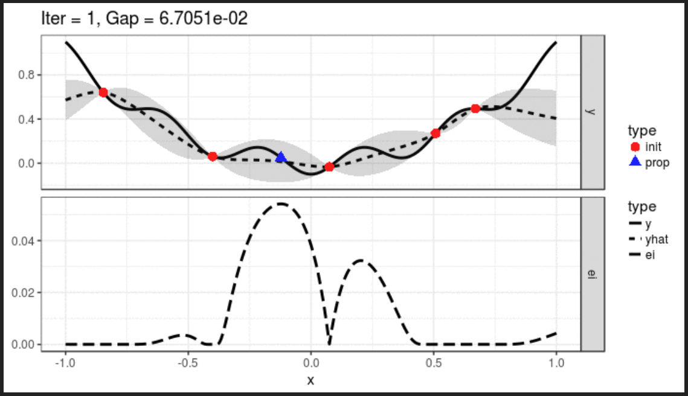

```{r, echo=F}
options(width = 120)
```

```{r}
library(mlr)
library(ggplot2)
library(parallelMap)
library(data.table)
library(dtplyr)
library(dplyr)
library(mlrMBO)
library(magrittr)

source("utils.R")
```

# Load Data: the Titanic dataset

```{r}
train <- fread("train.csv", na.strings = c(""," ","<NA>",NA), 
               colClasses = c("factor","logical","factor","character","factor","numeric","integer","integer","character","numeric","character","factor") )

test <- fread("test.csv", na.strings = c(""," ","<NA>",NA),
              colClasses=c("factor","factor","character","factor","numeric","integer","integer","character","numeric","character","factor"))

```

# Data Exploration

Let's see the data:

```{r}
head(train,20)
```

The package includes a couple of friendly methods to explore the dataset:

We have a couple of features with NA's on the dataset.

```{r}
summarizeColumns(train)
```

disp is the measure of dispersion, for numerics and integers standard deviation is used, for categorical columns the qualitative variation.

I find it much clearer than the standard R summary:

```{r}
summary(train)
```

# Preprocessing

## Data cleaning

```{r, Data Cleaning}

train <- preprocess(train) # take care of names, cabins
test <- preprocess(test)

train <- as.data.frame(train)  # some issues working with data.table
test <- as.data.frame(test)

```

```{r}
summarizeLevels(subset(train,select=-c(PassengerId, Name, Ticket, Cabin, LastName)))
```

```{r}
summarizeColumns(train)
```
## Filter outliers

```{r, View outliers}

ggplot(train)+geom_histogram(aes(x=Fare),binwidth=20)

```

```{r, Filter outliers}

thr <- 300
train <- capLargeValues(train, cols = c("Fare"), threshold = thr)
test <- capLargeValues(test, cols = c("Fare"), threshold = thr)

ggplot(train)+geom_histogram(aes(x=Fare),binwidth=20)

```

## Leveraging Caret

MLR offers the possibility to call Caret preprocess methods through the  makePreprocWrapperCaret method.

```{r, Leveraging Caret, eval=FALSE}

# makePreprocWrapperCaret(learner, ppc.knnImpute = TRUE, ppc.pca = TRUE, ppc.pcaComp = 10)

```

# Missing Value Imputation

## Simple methods

```{r}

impSimple <- impute(train, 
              cols = list(Embarked = imputeMode(), Age = imputeMean()), 
              dummy.cols = c("Age"), 
              dummy.type = "numeric")

```

The object returned by impute has two parts, "data" that contains the transformed data:

```{r}
summarizeColumns(impSimple$data[,c("Embarked","Age","Age.dummy")])
```

And desc that contains the parameters of the imputation:

```{r}
impSimple$desc$impute$Age
```

## Type based

We can also impute all variables depending on their type:

```{r, eval=F}

# Type based

impType <- impute(train, 
                  classes = list(numeric = imputeMean()),
                  dummy.classes = c("numeric"),  dummy.type = "numeric")

```

## Using a learner

Imputation can also be done using any of the supported learners, here we use a decision tree:

```{r}

impRPart <- impute(train[,c(-1)], 
                    target = "Survived",
                    cols = list(Age = imputeLearner(makeLearner("regr.rpart"), features=c("SibSp","Parch","Sex","Fare"))
                               ,Embarked = imputeLearner(makeLearner("classif.rpart"), features=c("SibSp","Parch","Sex","Fare"))),
                    dummy.cols = c("Embarked","Age"),
                    dummy.type = "numeric")

```

## Custom Learners

Custom Imputation methods can be written based on MakeImputeMethod. I implemented mean grouped by another categorical variable:

```{r}

imputeByCategory <- function( feature ) {
  
  makeImputeMethod(learn = function(data, target, col, ...) {
    input_list <- list(...)
    var <- input_list[["var"]]
    values <- data %>% 
      select_( var, col) %>% 
      group_by_(var) %>% 
      summarise_(.dots=setNames( paste0('mean(',col,',na.rm=T)'), paste0('mean_',col)))
    return(list(values=values, var=var))
  }, 
  impute= function(data, target, col, values, var) {
    x <- data[[col]] 
    ed <- data[[var]][is.na(x)]
    nv <- sapply(ed, function(y) {  # this sapply is not needed...
      values %>% 
        filter_(paste0(var,' == "', y, '"') ) %>% 
        select_(paste0('mean_', col)) %>% 
        unlist %>% 
        unname } ) 
    
    replace(x, is.na(x), nv)
  }, 
  args  = list(var=feature)
  )
}

impCustom <- impute(train, cols=list(Age=imputeByCategory("Sex")), dummy.cols = c("Age"), dummy.type = "numeric")

```

## Applying the imputation

We make the imputation final and apply the same imputation also to the test data:

```{r}
train <- impSimple$data

test <- reimpute(test, impSimple$desc) # this contains the imputation algorithm

summarizeColumns(test)
```

#Feature engineering

```{r, Feature Engineering}
train <- featureEngineering(train)
test <- featureEngineering(test)
```

Some new built features (Child, FamilySize,Nobility):

```{r}
summarizeColumns(train)
```

# Task

The main part is creating a Task that will contain the data to be used, specifying the target variable and the value of the positive case:

```{r, Machine Learning Task}

# it doesn't accept Logical or Character fields, must be factor

train <- reType(train)
test <- reType(test)

#Create a task indicating the positive class.

trainTask <- makeClassifTask(data = train, target = "Survived", positive = "1")

test$Survived <- as.factor(0)

testTask <- makeClassifTask(data = test, target = "Survived")

trainTask

```

# Learners

```{r, Learners List}
lstLearners <- listLearners("classif")
```

```{r}
setDT(lstLearners)
lstLearners
```

Supports:

84 Classifiers
64 Regression
15 Survival
9 Cluster analysis (yes, unsupervised)

## Learning about the parameters

```{r, Training RandomForest}
getParamSet("classif.randomForest")
```
```{r, RandomForest Learner}
rf <- makeLearner("classif.randomForest", predict.type = "prob")
rf
```
#Feature Selection

Features can also be removed from the task, they are not used in training but remain in the data:

```{r, Drop Features}
trainTask <- dropFeatures(task = trainTask, features = c("PassengerId","Name","LastName","Ticket","Cabin"))
trainTask
```
## Feature Importance

```{r, Variable Importance}
varImp <- generateFilterValuesData(trainTask, method = c("information.gain"))
plotFilterValues(varImp,n.show = 20)
```

```{r, Drop Some More Features}
filteredTask <- filterFeatures(trainTask, fval = varImp, threshold = 0.001)
filteredTask
```

It is also possible to normalize and remove constant features in the learning task.

```{r, Normalize}
trainTask <- normalizeFeatures(trainTask, cols="Age", method = "standardize")
testTask <- normalizeFeatures(testTask, cols="Age", method = "standardize")

summarizeColumns(trainTask$env$data[,c("Age"), drop=F])
```
# Resampling strategy:

Other methods include repeatCV, bootstrap, holdout, leave-one-out, subsampling :

```{r}
#set 3 fold cross validation
set_cv <- makeResampleDesc("CV", iters = 3L)
set_cv
```

# Parallelization

Costly operations can be parallelized, using the parallelMap package.
Supports multiple backend:
- local multicore execution using parallel, 
- socket and MPI clusters using snow, 
- makeshift SSH-clusters using BatchJobs and 
- high performance computing clusters (managed by a scheduler like SLURM, Torque/PBS, SGE or LSF) also using BatchJobs

```{r, Parallel}
parallelGetRegisteredLevels()
```

```{r}
parallelStart(mode="socket", cpus=4, level= "mlr.tuneParams") # one or all 
# "mlr.benchmark","mlr.resample","mlr.selectFeatures","mlr.tuneParams","mlr.ensemble"))
```

```{r}
parallelGetOptions()
```

## Feature Selection

```{r}
# method = "sfs" indicates that we want to conduct a Sequential Forward Search where features are added to the model until the performance cannot be improved anymore
set.seed(0)
ctrl <- makeFeatSelControlSequential(method = "sfs", alpha = 0.01)
sfeats <- selectFeatures(learner = rf, task = trainTask, resampling = set_cv, control = ctrl, show.info = FALSE, measures = auc)
sfeats
```

```{r}
analyzeFeatSelResult(sfeats)
```


## Parameter tuning

Define the parameters to be tuned, generating both continuous and discrete search spaces:

```{r}

#set tunable parameters
#grid search to find hyperparameters

rf_param <- makeParamSet( makeIntegerParam("ntree", lower = 50, upper = 500),
                          makeIntegerParam("mtry", lower = 3, upper = 8),
                          makeIntegerParam("nodesize", lower = 10, upper = 50))
```

How the search is going to be made (other methods include GridSearch, SimulateadAnnealing, BayesianOptimization ):

```{r}
#let's do random search for 50 iterations
ranControl <- makeTuneControlRandom(maxit = 50L)
```

Finally, we run the parameter tuning:

```{r}
set.seed(0)
rf_tuneRan <- tuneParams(learner = rf, 
                      resampling = set_cv, 
                      task = trainTask, 
                      par.set = rf_param, 
                      control = ranControl, 
                      measures = auc)
```

```{r}
#cv accuracy
rf_tuneRan$y
```

```{r}
#best parameters
rf_tuneRan$x
```

The effect of the parameters can be visualized pairwise, even when we have used more than two params. A learner is specified to "extrapolate":

```{r, Params dependence}
data <- generateHyperParsEffectData(rf_tuneRan, partial.dep = T)
plt <- plotHyperParsEffect(data, x = "ntree", y = "mtry", z = "auc.test.mean", plot.type = "heatmap",  partial.dep.learn = "regr.randomForest")
min_plt = min(data$data$auc.test.mean, na.rm = TRUE)
max_plt = max(data$data$auc.test.mean, na.rm = TRUE)
med_plt = mean(c(min_plt, max_plt))
plt + scale_fill_gradient2(breaks = seq(min_plt, max_plt, length.out = 5), low = "blue", mid = "white", high = "red", midpoint = med_plt)
```

The best params are then used to build the final model and calculate predictions:

```{r}
#using hyperparameters for modeling
rf.tree <- setHyperPars(rf, par.vals = rf_tuneRan$x) 
#train a model
rforest <- train(rf.tree, trainTask)
getLearnerModel(rforest)
```

```{r, Error Analysis}
oob_preds <- getOOBPreds(rforest, trainTask)
df <- generateThreshVsPerfData(oob_preds, measures = list(fpr, tpr, mmce, npv))
plotThreshVsPerf(df)
```

```{r, ROC Curve Analysis}
df <- generateThreshVsPerfData(list(train = oob_preds), measures = list(fpr, tpr))
plotROCCurves(df)
```
```{r}
performance(oob_preds, auc)
```

# Hyper Parameter Optimization

Works  (using different approaches) for different types of variables.

Balance explotation/exploration




```{r}
# mlrMBO part
mboControl <- makeMBOControl()
mboControl <- setMBOControlTermination(mboControl, iters = 15)  # in addition to the initials
mboControl <- setMBOControlInfill(mboControl, crit = makeMBOInfillCritAEI()) # augmented expected improvement
# mlr part
tuneMBOControl <- makeTuneControlMBO(mbo.control = mboControl)
#run <- exampleRun(obj.fun, learner = rf, control = mboControl, show.info = FALSE)
```

```{r, results='asis'}
set.seed(0)
outer <- makeResampleDesc("CV", iters = 3)
resTune <- tuneParams(learner=rf, 
                resampling = outer, 
                task=trainTask, 
                measures=auc, 
                par.set = rf_param, 
                control = tuneMBOControl, 
                show.info = F)
```
```{r}
resTune
```
# Comparing Models

```{r}
outer <- makeResampleDesc("Subsample", iter = 3)
lrn <- makeFeatSelWrapper(learner = rf, 
                           resampling = outer, 
                           measures = auc, 
                           control = ctrl)
resBMR <- benchmark(tasks = trainTask, 
                   learners = list(lrn, rf), 
                   resampling = outer, 
                   show.info = FALSE,
                   measures = auc)
```

```{r}
resBMR
```

```{r}
getBMRPerformances(resBMR, as.df = TRUE)
```

# Finally, once you have got the model to be used:

Make final predictions on the test data set:

```{r}
# make sure the factors have the same Levels
testTask$env$data <- checkLevels(trainTask$env$data, testTask$env$data)
rfmodel <- predict(rforest, testTask)
rfmodel
```

# Putting all together

Note to self(TBC): If I am not mislead not all combinations are possible... like Tune Params and Feature Selection... if all the parameters are to be recovered, because only benchmark and resample allow the detailed results collection. 

```{r}
rm(list=ls())
source("utils.R")
varTypes <- c("factor","character","factor","numeric","integer","integer","character","numeric","character","factor")
train <- fread("train.csv", na.strings = c(""," ","<NA>",NA), colClasses = c("factor","logical",varTypes) )
test <- fread("test.csv", na.strings = c(""," ","<NA>",NA), colClasses=c("factor",varTypes) )
train <- train %>% preprocess %>% as.data.frame
test <- test %>% preprocess %>% as.data.frame
thr <- 300
train <- capLargeValues(train, cols = c("Fare"), threshold = thr)
test <- capLargeValues(test, cols = c("Fare"), threshold = thr)
impSimple <- impute(train, cols = list(Embarked = imputeMode(), Age = imputeMean()), dummy.cols = c("Age"), dummy.type = "numeric")
train <- impSimple$data
test <- reimpute(test, impSimple$desc) # this contains the imputation algorithm
train <- train %>% featureEngineering %>% reType
test <- test %>% featureEngineering %>% reType
trainTask <- makeClassifTask(data = train, target = "Survived", positive = "1")
test$Survived <- as.factor(0)
testTask <- makeClassifTask(data = test, target = "Survived")
trainTask <- dropFeatures(task = trainTask, features = c("PassengerId","Name","LastName","Ticket","Cabin"))
rf <- makeLearner("classif.randomForest", predict.type = "prob") 
set.seed(0)
ctrl <- makeFeatSelControlSequential(method="sfs")
inner <- makeResampleDesc("Subsample", iters = 3)
lrn <- makeFeatSelWrapper(learner = rf, resampling = inner, measures = auc, control = ctrl)
outer <- makeResampleDesc("CV", iters = 3)
resFull <- benchmark(task = trainTask, learners = list(lrn, rf), resampling = outer, measures = auc, show.info = F)
```

```{r}
resFull
```

```{r}
resFull$results
```

```{r}
getBMRFeatSelResults(resFull)
```

```{r}
feats <- getBMRFeatSelResults(resFull, learner.id = "classif.randomForest.featsel", drop = TRUE)
opt.paths <- lapply(feats, function(x) as.data.frame(x$opt.path))
head(opt.paths[[1]])
```

```{r}
analyzeFeatSelResult(feats[[1]])
``` 

```{r}
# Stop parallel execution
parallelStop()
```